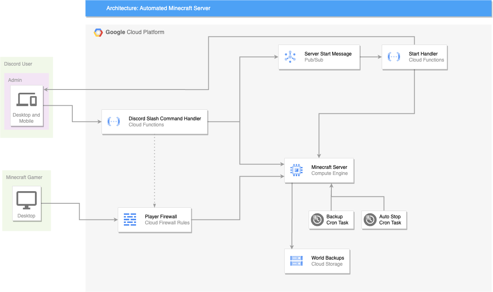

# Minecraft GCP
This repository is the perfect way to over engineer a minecraft server.

My main goals for this project are to:
- Learn GCP and Terraform
- Host a Minecraft Server in GCP cheaply
- Control the server from Discord

## Infrastructure

## Features
- [x] Discord Slash Commands for Server Management
- [ ] Firewall Rules w/ Some Kind of Invite System?
- [ ] World Backup System
- [ ] Automated Shutdown System (when server is empty)

## Setup
### GCP (https://console.cloud.google.com/)
1. Create a new project on GCP
2. Enable Billing for the Project
3. Create a new service account
4. Download the service account key as a JSON file and save it as `service-account-key.json` in the root of this repository
5. Enable the Compute Engine API, Cloud Build API, Cloud Run Admin API, Cloud Functions API, Artifact Registry API, Secret Manager API, and IAM API

### Discord (https://discord.com/developers/applications)
1. Create a new application
2. Fill in the functions/discord-interactions/.env with info from the application. See [functions/discord-interactions/.env.sample](functions/discord-interactions/.env.sample) for an example.
3. Invite the bot to your discord server by generating a link in the OAuth2 tab of the application page.

## Deployment
1. Run `./build.sh` to build applications and packages
2. Run `./deploy.sh` to deploy the infrastructure
3. Copy the outputted `function_uri` from the terminal.
4. Go to https://console.cloud.google.com/run, select the `discordinteractions` service, go to security tab, and change the authentication to `Allow unauthenticated invocations`.
5. Go to the discord developer portal, navigate to your application, and under the general information tab set the `INTERACTIONS ENDPOINT URL` to the `function_uri` from step 3.

